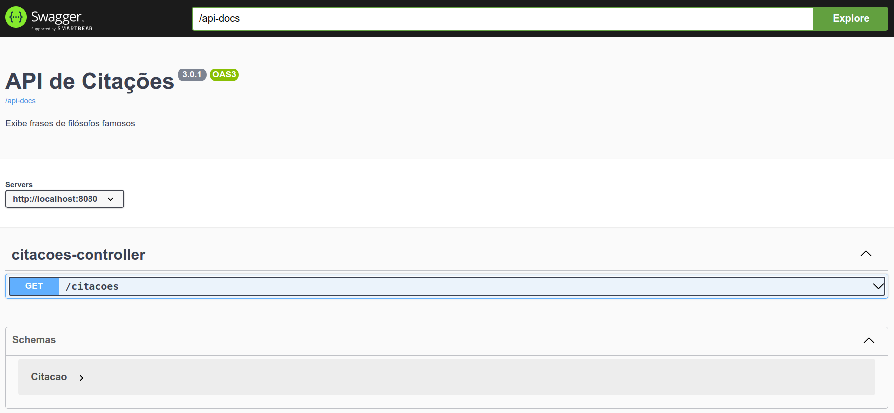

# citacoes-web

  Projeto que exibe citaçẽs de filósofos famosos. Aprenda como criar uma documentação Open API (Swagger) para a sua Rest API.
  
  
  ## Tecnologias

- [Java 11](https://youtu.be/_NCt_82M0MA)
- [Maven](https://youtu.be/edF1G8RYDTU)
- [Open Api](https://www.openapis.org/) - Swagger

## Open Api (Swagger)

 

## 📺 Link dos vídeos

 [Criando uma Open API](https://youtu.be/uQh6PNLZzug)
